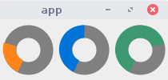

OSC-controller
===============================================

The dragon-osc is an app for building custom OSC-controllers.
We can specify the UI with markup language that is based on YAML or JSON file.
We specify the layout of the widgets and the interaction of the parts.

The primary goal of the app is to receive and send OSC-messages. 

Features:

* Many widgets useful for audio: toggles, knobs, faders, buttons, XY-pads, etc

* Easy way to make complex layouts with relative sizes.

* We can send OSC-messages to many OSC-clients. 

* We can send many OSC-messages at the same time (based on the single event). It can be
  useful for setting up a scene for a track. 

* Dynamic update of the widgets look. The app itself can be changed with specific OSC messages

* We can trigger and control all widgets with code by sending OSC-messages, 
  so the app can be used as a visual guide for generative music. Imagine an algorithm
  that sends the control messages to the app and the app sends it to synthesizers.

* We can create complex keyboard hot-keys and hot-keys can be specific to the selected window/tab-page.
   This can turn our keyboard to a musical controller.

* The app-config file is JSON or YAML file it makes it easy to create layouts with code.

### Installation

To run the app we need git and sbt. Git is for cloning the repo and sbt 
is for building everything. The app is made with Scala. The sbt is a standard tool to make Scala applications and libraries.

Clone the repo:

~~~
> git clone https://github.com/anton-k/dragon-osc.git
~~~

Navigate to the directory  and run `sbt`:

~~~
> cd dragon-osc
> sbt
~~~

Now we can run the app with run command:

~~~
> run -i /path/to/config.yaml
~~~

Where `config.yaml` is our own file where we can specify our OSC-controller.

Also by typing in sbt prompt:

~~~
> assembly
~~~

We can create a single jar which we can run with java:

~~~
> java -jar dragon-osc.jar
~~~

The jar-file will be written in the directory target/scala-2.*

### Hello world!

Let's create a simple UI program and invoke it with our program. 

~~~yaml
main:
   - window:
      title: app
      size: [200, 100]
      content:
        label:
          text: "Hello World!"
~~~

Let's save the file to hello.yaml load the project with `sbt` and invoke the app with it:

~~~
> sbt
> run -i hello.yaml
~~~

The flag `-i` says where is the config file for the app.
Every config-file should has the root element called `main`. 
Then within the `main` we list the windows of the app. 

Window has the attributes: `title` (string), `size` (pair encoded as list), `content` (all ui elements).
We have defined a single UI-element that only shows the string. The widget is a `label`.

#### Simple layout 

Let's go to the more interesting widgets. We can stack many widgets horizontally or vertically with `hor` and `ver`.
Let's create some knobs:

~~~yaml
main:
   - window:
      title: app
      size: [200, 100]
      content:
        hor:
          - dial: 
              init: 0.25
              color: "orange"
          - dial:
              init: 0.5
              color: "blue"              
          - dial:
              init: 0.75
              color: "olive"
~~~

We create three knobs with different initial values and colors.
We can change the values with mouse. Try to change the `hor` with `ver` and see what happens.

How can we send the OSC-messages with those knobs?

#### The OSC-messages

The OSC-message consists of three parts:

* `client` to whom we send the message

* `path`  on which the recipient listens

* `args` the list of arguments

Here is the simple message:

~~~yaml
msg:
    client: jack
    path:   /amp
    args:   [0.2]
~~~

We can specify the message with attribute `send`:

~~~yaml
- dial: 
    init: 0.25
    color: "orange"
  send:
    - msg:
        client: jack
        path:   /amp
        args:   [$0]
~~~

Notice that the field `send` is on the same level as dial` (not inside the send's fields).

The special syntax `$int` means read the value from the N's input of the current value of the widget.
In this example we read a single value of the knob. 

The OSC-servers listen on specific ports. In the app the ports are specified by names. We assign the
actual port to the name in the command line argument `-c`  or `--clients`: 

~~~
run --verbose  -i hello.yaml -c jack=7654
~~~

Also we specify the flag `--verbose` to see the prints of the sent messages. 

Notice that when we send messages we use the sign `-` before the `msg`-tag. 
It means that we can send multiple messages with the same click or switch.
This can be useful for complex updates of the setup. When for instance
tack changes and we want to preload all the samples and change the names of
all widgets for the specific track.

### Faders

We can substitute dials with faders:

~~~yaml
main:
   - window:
      title: app
      size: [300, 100]
      content:
        ver:
          - hor:
              - label:
                  text: cps
              - hfader: 
                  init: 0.25
                  color: "orange"
                send:
                  - msg:
                      client: synth
                      path:   /amp
                      args:   [$0]
          - hor:
              - label:
                  text: amp
              - hfader:
                  init: 0.5
                  color: "blue" 
                send:
                  - msg:
                      client: synth
                      path:   /amp
                      args:   [$0]
~~~

We control two parameters amplitude and frequency of our synthesizer. 

### Buttons and toggles

Let's send the notes in the separate window. The content of the first window is going to be the same but
we are going to add another window with button and toggle:

~~~yaml
main:
   - window:
     title: ap1
     content:
        ...
        ...
   - window:
      title: ap2
      content:
        hor:
          - button:
              color: orange
            send:
              - msg: { client: "synth", path: "/play-note", args: [440] }
          - toggle:
              init: false
              color: green
            send: 
              - msg: { client: "synth", path: "/mute", args: [$0] }
~~~

The button sends the message when it's pressed.
The toggle can send two types of messages. Also we can specify
the toggle messages with special syntax:

~~~yaml
          - toggle:
              init: false
              color: green
            send: 
              case true:
                  - msg: { client: "synth", path: "/play", args: [] }
              case false:
                  - msg: { client: "synth", path: "/stop", args: [] }
~~~

We can write `case value` and the message is going to be sent only if current value
equals to the case. Also we can use this method with integer and string

There are many more widgets you can check out the full list at the section `Widgets` of this guide.

### Let's make tabs

Also we can group UI's with tabs:

~~~yaml
tabs:
    - page:
        title: first
        content: ...
    - page:
        title: second
        content: ...
~~~

### Using app as a server

We can not only send OSc-messages also we can receive messages.
We can send the messages to app to simulate the user interaction
and to change some basic look and feel attributes (like colors or texts).

To receive messages we should specify the port on which we expect messages to come.
we do it with command line flag `-s` or `--server`:

~~~
> run -s 8800 -i config.yaml -c unit=7000
~~~

To send the message to interact with the widget we need to give it a name or an `id`entifier:
Let's for example give the identifier to the fader:

~~~
vfader:
    init: 0.2
    color: olive
id: amp
~~~

We can send the OSC-message to our app to update the value of `amp` fader:

~~~yaml
{ path: "/amp", args: [0.5] }
~~~

This will update the visual widget and send all the messages for the widget. 
There is a hack if we want only to update the visual representation but not send the 
messages of the widget. We should prefix with "/cold":

~~~yaml
{ path: "/cold/amp", args: [0.5] }
~~~

Like this we can set the toggles  or click the button (with button the argument list is empty).
The general idea is to write the name of the identifier in the path and set the value in the arguments.

#### Updating the float producing widgets

We can make relative changes. We can add specific amount to the current value of the float producing widget (like `dial`, `hfader` or `vfader`).

~~~yaml
{ path: "/id/add-float", args: [0.1] }
~~~

We write id in the path next we write `add-float` and pass the value to add in the argument.

#### Updating values of the toggles

We can switch the value of the toggle with syntax:

~~~yaml
{ path: "/id/toggle", args: [] }
~~~

There is a useful widget called `multi-toggle` it contains a matrix of toggles.
We can toggle the value in the give cell like this:

~~~yaml
{ path: "/id/multi-toggle", args: [1, 2] }
~~~

Where `args`-list contains x, y coordinates of the cell

#### Set colors

We can set colors:

~~~yaml
{ path: "/id/set-color", args: [color-name] }
~~~

#### Set texts

We can set text for widgets:

~~~yaml
{ path: "/id/set-text", args: [text] }
~~~

We can set text for multi-toggles:

~~~yaml
{ path: "/id/set-text-list", args: [2, text] }
~~~

#### Sending the OSC-messages to the self

Sometimes we want to update the look and feel of the app with widgets o the app itself.
For instance if we press on the given button all names in the specific widget should change.
It's possible to achieve this by sending the messages to the client with the name `"self"`.
The `self` is a reserved name for this case.

### Hot-keys

A cool feature of the app is the ability to create complex hot-key mappings.
The mappings can be not only global for the entire app but also specific to windows
and even to tabs. With this feature we can convert our keyboard to sophisticated controller.

To add global hot-keys we use the tag `keys` at the same level as `main`-tag. To add window specific
hot-keys we use it at the same level as `window`` to add tab specific keys we add it
at the same level as `page`-tag:

* global hot-keys:

    ~~~yaml
    main:
        - window: { ... }
        - window: { ... }
    keys:
        - key: { ... }
        - key: { ... }
    ~~~

* window specific keys. They are active only when the window is selected:

    ~~~yaml
    main:
        - window: { ... }
          keys: [ ... ]
        - window: { ... }
          keys: [ ... ]
    ~~~

* tab specific keys. They are active only when the page is selected:

    ~~~yaml    
    main:
        - window: 
            content:
                tabs:
                    - page: { ... }
                      keys: [ ... ]
                    - page: { ... }
                      keys: [ ... ]               
    ~~~

#### How to specify the key

The `keys`-tag contains a list of hot-keys. The hot-key triggers the process of sending OSC-messages.
That's it. When we press a certain key the list of messages is going to be sent.

So there are two components: key name and the list of messages.

~~~yaml
keys:
    - key: "a"
      send:  [ message list ]

    - key: "b"
      send: [message list ]
~~~

We write the name of the hot-key in the `key` field and we specify
the message list in  the same way as we did it with widgets. We use the `send`-tag.

If want to use the key pressed with modifier such as **Control** or **Shift** we 
should list all the modifiers in the list in the `key`-tag:

~~~yaml
keys:
    - key: [ ctrl, a]
      send:  [ message list ]

    - key: [shift, alt, b]
      send: [message list ]
~~~

All keys are follow their latin names, there are also special keys like:

~~~yaml
ctrl, alt, shift, windows, 
delete, insert, home, end
up, down, left, right, page-up, page-down
f1, f2, f3, ...
1,2,3,4, ...
~~~

#### Changing the tabs with hot keys

Notice that the tab can also produce the OSC-message. Every tab change is
equivalent to setting the integer state of the tab to the given integer. 

So we can ive the tab-widget a name (`id`) and send the messages to it like this:

~~~yaml
msg: { client: "self", path: "/tab-id", args: [3] }
~~~

It can be useful to quickly change the tabs and possibly hot-key mappings.

### Init script

When the app starts it sends all the values from the `init`-tags of the widgets.
Sometimes we want to execute specific commands on start up to set up the scene.
we can specify all the messages to send on start up in the tag: `init-send` :

~~~yaml
main: { ... }
keys: [ ... ]
init-send: [ message list ]
~~~

### Lock the exit

If we close any of the window all other widows are going to shut down.
It can be undesirable to shut down the windows at the single click. 
It can happen by mistake in the mid of the concert and we can lost 
all the visual representation of the scene. to prevent this from happening
we can use the flag: `--lock-on-exit`. 

It will require to type the word `exit` to close the app.

### Colors

Here is the list of color names: 

~~~
navy, blue, aqua, teal, olive, green, lime, yellow, 
orange, red, maroon, fuchsia, purple, black, gray, silver, white, any.
~~~

`any` -- means any color at random. 

### Widgets

Here is the list of all available UI-elements:

#### Layout:

##### Horizontal layout

~~~yaml
hor:
    - widget1
    - widget2
    - widget3
~~~

##### Vertical layout

~~~yaml
ver:
    - widget1
    - widget2
    - widget3
~~~

#####  Tabs:

~~~yaml
tabs:
    - page:
        title: "page A"
        content: { ... }            
    - page:
        title: "page B"
        content: { ... }
~~~

Tabs can be placed not only at the root of the window but also anywhere inside the layout.
Tabs are also integer value producers/ When can send OSC-messages on selecting the tab:

~~~yaml
tabs:
    - page: { ... }
    - page: { ... }
send:
    - msg: { ... }
~~~

##### Empty space

We can create an empty space of the given size within the vertical or horizontal layout.

~~~
space: 35
~~~

#### Display

With `label` we can show a static text:

~~~yaml
label: 
    text: "hi"
    color: black
~~~

#### Value producers

##### Button

With `button` we can produce single message (click or ping)

~~~yaml
button:
    color: orange
    text:  "Click me"    # Optional field
send:
    - msg: { ... }
~~~

##### Toggle

With toggles we can send alternating messages when toggle on or off happens:

~~~yaml
toggle:
    color: olive
    text:  click
    init:  true | false
send:
    case true:
        - msg: { ... }
    case false:
        - msg: { ... }
~~~

Or we can pass the current value with the `$0` reference.

~~~yaml
- msg: { client: name, path: /on/a, args: [$0] }
~~~

#### Circle buttons and toggles

There are circle toggles and buttons. They behave like the normal corresponding widgets
but look smaller and we can not show text with them. Their tags are `circle-button` and `circle-toggle`.

#### Multi-toggle buttons

We can create a matrix of toggles with widget `multi-toggle`:

~~~yaml
multi-toggle:
    init: [0, 1, 2]
    size: [2, 4]
    texts: [a, b, c, d, ...]
    color: purple
~~~

#### A float producers

We can produce a single float value with `dial`, `vfader`, `hfader`. 
They send similar OSC-messages but the visual representation is different.
The example is for `dial`'s but we can substitute the tag with `vfader` and `hfader`
to produce vertical and horizontal faders:

~~~yaml
dial:
    color: green
    init:  0.5
    range: [0, 1]  
~~~

All fields are optional. The default range is 0 to 1. Some synthesizers expect
the value to be in midi range 1 to 127. We can alter the range like this:

~~~yaml
dial:
    color: green
    init:  70
    range: [1, 127]  
~~~

#### An integer producers

There are several widgets that produce integer values.

##### Send integers

We can send the value with reference `$0` also note that we can use `case`:

~~~yaml
send:
    case 0:
        - msg: { ... }
    case 1:
        - msg: { ... }
    case 2:
        - msg: { ... }
    default:
        - msg: { ... }
~~~

There is a shortcut:

~~~yaml
send:
    int:
        - msg: { ... }  # case 0
        - msg: { ... }  # case 1
        - msg: { ... }  # case 2
~~~

##### Integer knob

`int-dial` -- looks like a knob but produces only integer values. The parameters are the same as for the dial:

~~~yaml
int-dial:
    color: olive
    init:  3
    range: [1, 10]
~~~

##### Radio buttons

We can represent multiple choice with `hcheck` and `vcheck`.

~~~yaml
hcheck:
    init: 0
    size: 4
    color: red
    texts: [one, two, three four]
    allow-deselect: true/false
~~~

The parameters are self-explanatory. The `allow-deselect` let's you turn off the button on second click.
If it's set to false we can only switch between the cases.

##### Drop down list

`drop-down-list` -- list of choices in the drop down list.

~~~yaml
drop-down-list:
    init: 2
    texts: [low-pass, high-pass, band-pass, notch]
~~~

#### Send strings

With `text-input` we can send strings:

~~~yaml
text-input:
    init: name
    color: blue
    text-length: 7  
~~~

#### Send file names

We can select files.

~~~yaml
text-input:
    init: name
    color: blue
    text: "Get file:" 
~~~

#### XY-pads

We can send a pair of floats with `xy-pad`:

~~~yaml
xy-pad:
    init:  [0.5, 0.25]
    color: blue
~~~

#### Send ranges

There are several widgets to select float intervals or ranges: `hfader-range`, `vfader-range`, `xy-pad-range`:

~~~yaml
hfader-range:
    init:  [0.2, 0.5]
    color: blue
~~~

The `vfader-range` is the same as `hfader-range`. With `y-pad-range` we can select a pair of intervals:

~~~yaml
xy-pad-range:
    init: [xMin, xMax, yMin, yMax]
    color: orange
~~~

We can reference the values from the body of OSC-message with references: `$0`, `$1`, `$2`, `$3`.

#### Tabbed radio buttons

There is a special widget to pack many options. 

~~~yaml
double-check:
    init: [0, 2]
    sizes: [4, 4, 3]
    color1: aqua
    color2: blue
    texts: [[a,b,c,d], [e,f,g,h], [x,y,z]]
    orient: [bool, bool, bool]
    allow-deselect: bool
~~~

It stacks several radio-button groups together with tabs. 
So there are two radio button groups, one to select the sub-groups
and another one to select the items. 

The orient is a triple of booleans. They define the representation
of the widget. The three booleans are:

* `isFirst` does the first panel comes first

* `isFirstHor` should the **first** panel be horizontal

* `isSecondHor` should the **second** panel be horizontal

Sizes  contains the sizes of all sub-groups and also it specifies how many sub-groups we need (it's the length of the list).

We can select the values with OSC-messages if we send:

~~~yaml
mag: { client: self, path: /id-of-unit/double-check/1, args: [int] }  # to update first group

mag: { client: self, path: /id-of-unit/double-check/2, args: [int] }  #           second  
~~~

#### Advanced OSC-messages

##### Reference to the value of the widget

We can reference the values of the widget-state with references `$N`, where `N` is some integer number.

~~~
msg: 
    client: name
    path:   /some/path
    args:   [$0]
~~~

##### Send message on deselect

Some widgets represent selection from multiple choices. We can send messages
not only on selection but also on de-selection.  With selection we prefix 
the choice number with `case`. For de-selection we can use `case-off`:

~~~
double-check:
    sizes: [8, 8, 8]
    orient: [true, true, false]
    texts: [ ... ]
    id: tracks
send:     
    case 0 0:  
        - msg: { ... }
    case-off 0 0:
        - msg: { ... we can close the resources for this choice ...  }

    case 0 1:  
        - msg: { ... }
    case-off 0 1:
        - msg: { ... }

    default:
        - msg: { ... }
~~~

Notice how we can use the multiple values in the `case`. We should delimit them with spaces.

##### The self client

We can send the messages to the app itself to change the look and feel or to trigger the widgets with hotkeys.
We can use it like this:

~~~
msg: 
    client: self
    path: /some/path
    args: [ ... ]
~~~
